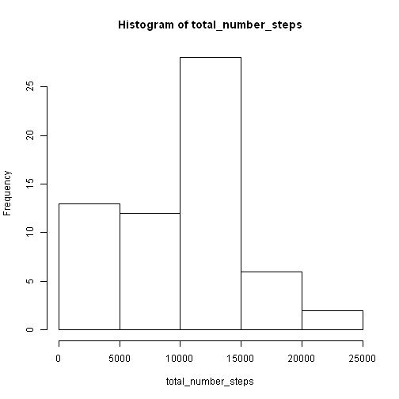

## Loading and preprocessing the data

```r
activity <- read.csv("activity.csv",colClasses = c("integer", "character", "character"))
activity$date <- as.Date(activity$date, "%Y-%m-%d") # transform to Date
# look a bit of the data
head(activity)
```

```
##   steps       date interval
## 1    NA 2012-10-01        0
## 2    NA 2012-10-01        5
## 3    NA 2012-10-01       10
## 4    NA 2012-10-01       15
## 5    NA 2012-10-01       20
## 6    NA 2012-10-01       25
```

## What is mean total number of steps taken per day?

```r
total_number_steps <- sapply(split(activity$steps, activity$date), sum, na.rm = TRUE)
mean_tns <- mean(total_number_steps)
median_tns <- median(total_number_steps)
dates <- as.Date(names(total_number_steps), "%Y-%m-%d")
#plot(dates, total_number_steps, type = "h", main = "Total Number of Steps Taken Each Day (2012)")
hist(total_number_steps)
```

 

The mean of total number of steps taken per day is 9354.2295082.  
The median of total number of steps taken per day is 10395.

## What is the average daily activity pattern?

```r
sub_activity <- subset(activity, interval == 5)
```


## Imputing missing values


## Are there differences in activity patterns between weekdays and weekends?
