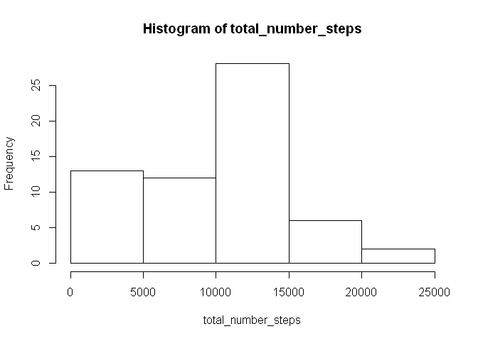
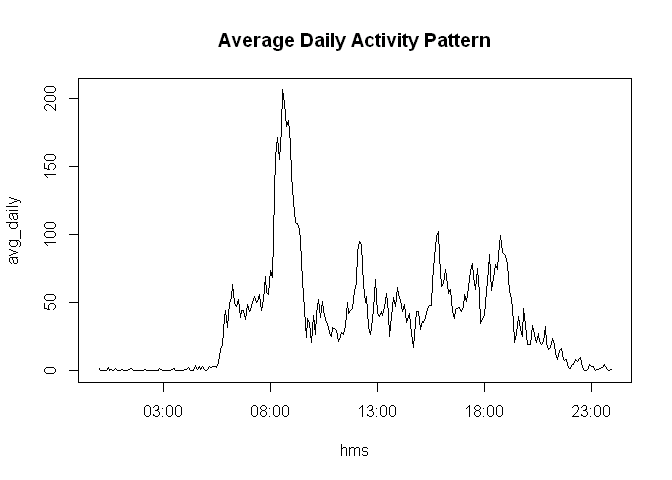
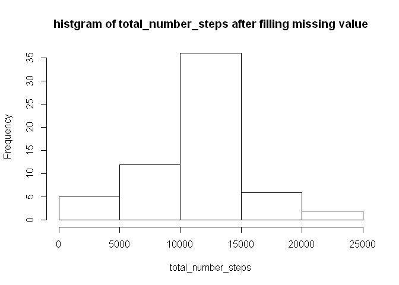

# Reproducible Research: Peer Assessment 1
Ada Lee  
Friday, January 16, 2015  


## Loading and preprocessing the data

```r
activity <- read.csv("activity.csv",colClasses = c("integer", "character", "character"))

format_interval <- function(c){
  res <- NA
  if(nchar(c) == 1) res <- paste("000", c, sep = "")
  if(nchar(c) == 2) res <- paste("00", c, sep = "")
  if(nchar(c) == 3) res <- paste("0", c, sep = "")
  if(nchar(c) == 4) res <- c
  
  res
}

activity$interval <- sapply(activity$interval, format_interval)
activity$date <- as.Date(activity$date, "%Y-%m-%d") # transform to Date
# look a bit of the data
head(activity)
```

```
##   steps       date interval
## 1    NA 2012-10-01     0000
## 2    NA 2012-10-01     0005
## 3    NA 2012-10-01     0010
## 4    NA 2012-10-01     0015
## 5    NA 2012-10-01     0020
## 6    NA 2012-10-01     0025
```

```r
tail(activity)
```

```
##       steps       date interval
## 17563    NA 2012-11-30     2330
## 17564    NA 2012-11-30     2335
## 17565    NA 2012-11-30     2340
## 17566    NA 2012-11-30     2345
## 17567    NA 2012-11-30     2350
## 17568    NA 2012-11-30     2355
```

## What is mean total number of steps taken per day?

```r
total_number_steps <- sapply(split(activity$steps, activity$date), sum, na.rm = TRUE)
mean_tns <- mean(total_number_steps)
median_tns <- median(total_number_steps)
dates <- as.Date(names(total_number_steps), "%Y-%m-%d")
#plot(dates, total_number_steps, type = "h", main = "Total Number of Steps Taken Each Day (2012)")
hist(total_number_steps)
```

 

### The mean of total number of steps taken per day is 9354.2295082.  
### The median of total number of steps taken per day is 10395.

## What is the average daily activity pattern?

```r
avg_daily <- sapply(split(activity$steps, activity$interval), mean, na.rm = TRUE)
hms <- strptime(names(avg_daily), "%H%M")
plot(hms, avg_daily, type = "l", main = "Average Daily Activity Pattern", xlab = "interval", ylab = "steps")
```

 

```r
max_avg_daily <- max(avg_daily)
avg_daily <- data.frame(interval = names(avg_daily), avg = avg_daily, stringsAsFactors = FALSE)
res <- subset(avg_daily, avg == max_avg_daily)
```
### 0835 of 5-minute interval, on average across all the days in the dataset, contains the maximum number of steps (206.1698113).

## Imputing missing values

```r
total_missing <- sum(is.na(activity$steps))
filled_activity <- activity

n <- length(filled_activity$steps)

# filling in all of the missing values of steps
# use the mean for that 5-minute interval
for (i in 1:n){
  item <- filled_activity[i, ]
  if (is.na(item$steps)){
    imputting <- subset(avg_daily, interval == item$interval)$avg
    filled_activity[i, ]$steps <- imputting
  }
}

# What is mean total number of steps taken per day
# after imputting missing values
total_number_steps <- sapply(split(filled_activity$steps, filled_activity$date), sum, na.rm = TRUE)
mean_tns <- mean(total_number_steps)
median_tns <- median(total_number_steps)
dates <- as.Date(names(total_number_steps), "%Y-%m-%d")
#plot(dates, total_number_steps, type = "h", main = "Total Number of Steps Taken Each Day (2012)")
hist(total_number_steps, main = "histgram of total_number_steps after filling missing value")  
```

 

### After filling missing values, the mean of total number of steps taken per day is 1.0766189\times 10^{4}. And the median of total number of steps taken per day is 1.0766189\times 10^{4}. These values differ from the estimates from the first part of the assignment. 

## Are there differences in activity patterns between weekdays and weekends?

```r
weekday_or_weekend <- function(d){
  weekend <- c("Saturday", "Sunday")
  weekdays_d <- weekdays(d)
  if (weekdays_d %in% weekend){res <- "weekend"}
  else {res <- "weekday"}
  
  res
}

# reate a new factor variable in the dataset with two levels -"weekday" 
# and "weekend" indicating whether a given date is a weekday or weekend day
filled_activity$weekday_or_weekend <- as.factor(sapply(filled_activity$date, weekday_or_weekend))
# summary filled_activity
summary(filled_activity)
```

```
##      steps             date              interval        
##  Min.   :  0.00   Min.   :2012-10-01   Length:17568      
##  1st Qu.:  0.00   1st Qu.:2012-10-16   Class :character  
##  Median :  0.00   Median :2012-10-31   Mode  :character  
##  Mean   : 37.38   Mean   :2012-10-31                     
##  3rd Qu.: 27.00   3rd Qu.:2012-11-15                     
##  Max.   :806.00   Max.   :2012-11-30                     
##  weekday_or_weekend
##  weekday:12960     
##  weekend: 4608     
##                    
##                    
##                    
## 
```

```r
splited_activity <- split(filled_activity, filled_activity$weekday_or_weekend)
weekday_activity <- splited_activity[["weekday"]]
weekend_activity <- splited_activity[["weekend"]]

## weekday 
weekday_avg_daily <- sapply(split(weekday_activity$steps, weekday_activity$interval),mean)
weekday_hms <- strptime(names(weekday_avg_daily), "%H%M")

## weekend
weekend_avg_daily <- sapply(split(weekend_activity$steps, weekend_activity$interval), mean)
weekend_hms <- strptime(names(weekend_avg_daily), "%H%M")

## 
par(mfrow = c(2, 1))
ylim <- c(0, ceiling(max(weekday_avg_daily, weekend_avg_daily)))

## plot weekday
plot(weekday_hms, weekday_avg_daily, type = "l", main = "Average Daily Activity Pattern on Weekday", ylim=ylim, xlab = "interval", ylab = "steps")

# plot on weekend
plot(weekend_hms, weekend_avg_daily, type = "l", main = "Average Daily Activity Pattern on Weekend", ylim=ylim, xlab = "interval", ylab = "steps")
```

 

### Weekdays have higher max steps.
